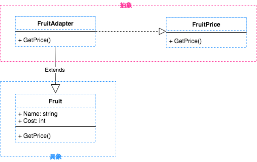

# adapter

* 互換性のないクラス同士を組み合わせる
* 継承や移譲

### メリット

* 既存のクラスに対して修正を加えること無くインターフェイスを変更出来る
* 一貫したインターフェイスの提供

### デメリット

* unit test しづらい
* 安易に使い回すとスパゲティになるかも
* 小さいパーツに、シンプルに、疎結合にすること

### Go の adapter

Go は interface があり、struct の埋め込みがあるので adapter はそれで事足りる

### 例題

* 太郎くんはクラスを楽しくさせる力がある
* 太郎くんを学級委員にさせるが、太郎くんは能力がないと言う
* 成長した太郎くんは能力を身につけることができた
