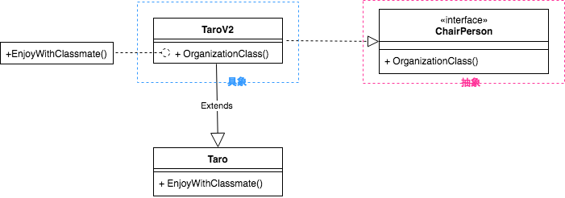

# adapter

- 互換性のないクラス同士を組み合わせる
- 継承や移譲
- 既存のクラスを使用したいが、そのインターフェイスが残りのコードと互換性がない場合これ

### メリット
- 単一責任の原則。インターフェイス、データ変換コードをビジネスロジックから分離できる
- オープンクローズド原則。クライアントインターフェイスを解して、アダプタと連携するので、
  既存のクライアントコードを破壊することがない

### デメリット
- unit test しづらい
- 安易に使い回すとスパゲティになるかも
- 小さいパーツに、シンプルに、疎結合にすること

### 他パターンとの関係性
- Bridgeはアプリケーションの一部を互いに独立して開発できるが、Adapterは互換性のないアプリを連携
- Adapterは既存のオブジェクトのインターフェイス変更、Decoratorはインターフェイスを変更せずオブジェクトを拡張
- Adapterはラップされたオブジェクトに異なるインターフェイスを提供、Proxyは同じインターフェイスを提供、Decoratorは拡張されたインターフェイスを提供
- Facadeは既存のオブジェクトの新しいインターフェイスを定義、Adapterは既存のインターフェイスを使用可能にする

### Go の adapter

Go は interface があり、struct の埋め込みがあるので adapter はそれで事足りる

### 例題

* 太郎くんはクラスを楽しくさせる力がある
* 太郎くんを学級委員にさせるが、太郎くんは能力がないと言う
* 成長した太郎くんは能力を身につけることができた
