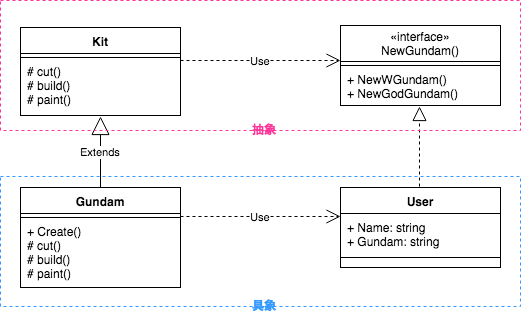

# FactoryMethod
オブジェクトの生成を分離

スーパークラスでオブジェクトを作成するためのインターフェイスを提供する作成デザインパターンですが、

サブクラスで作成されるオブジェクトのタイプを変更できます。

コードでしようするオブジェクトの性格なタイプと依存関係が事前にわからない場合はこれ

### メリット
- 作成者と具体的な製品の相田の密結合を避ける
- 単一責任の原則。製品作成コードをプログラムの1つの場所に移動して、コードのサポートが簡単に
- オープンクローズドの原則。既存のクライアントコードを壊すことなく新しいタイプの製品を導入できる
  
### デメリット
- パターンを実装するために、多くの新しいサブクラスを導入する必要があり、コードが複雑になる
- 機能を増やすにはfactoryクラスのメンテナンスが必要

### 他パターンとの関係性
- FactoryMethod > AbstractFactory > Prototype > Builder順で使う

### ポイント
- DIContainer = Factoryの集合体
- factoryはconrainerパッケージを用意するなり、配列で管理するなりしたほうが、一箇所に集約されて相互importの心配をしなくてよい

### 例題1
- TemplateMethodを応用して、
- 太郎くんはウィングガンダムが作りたいと言った
- 次郎くんはゴッドガンダムが作りたいと言った
- この際、どのガンダム作るかは彼らに任せよう！

### 例題2
- 前提として、クラスや継承などのOOP機能がないため、Goで従来のファクトリメソッドパターンを実装することは不可能
    - パターンの基本バージョンであるSimpleFactoryは引き続き実装できる
- さまざまな種類の武器を作成
- iGun銃が持つべきすべてのメソッドを定義するインターフェースを作成
- ak47, musket
