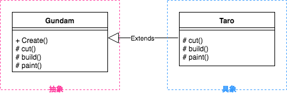

# TemplateMethod
異なる色のペンや、筆で書いても同じ形になる

スーパークラスで処理を決め、サブクラスで構造を変更せずに具体的な内容を定めるパターン

クライアントにアルゴリズムの特定のステップのみ拡張させたいならこれ

### メリット
- TemplateMethodのみを修正すればOKなので楽
- サブクラスの設計が簡潔

### デメリット
- サブクラスを解したデフォルトのステップ実装を抑制することで、リスコフの痴漢原則に違反する可能性がある
- 継承をしていること
  - 低凝集度
  - 密結合
  - 変更に弱い
  - 再利用性が低い

### 例題
- ワンタイムパスワード（OTP）機能
- OTPをユーザーに配信する方法はいくつかあります（SMS、電子メールなど）
- ただやってることは同じ
  - ランダムなn桁の数字を生成します。
  - 後で確認できるように、この番号をキャッシュに保存します。
  - コンテンツを準備します。
  - 通知を送信します。
  - 指標を公開します。